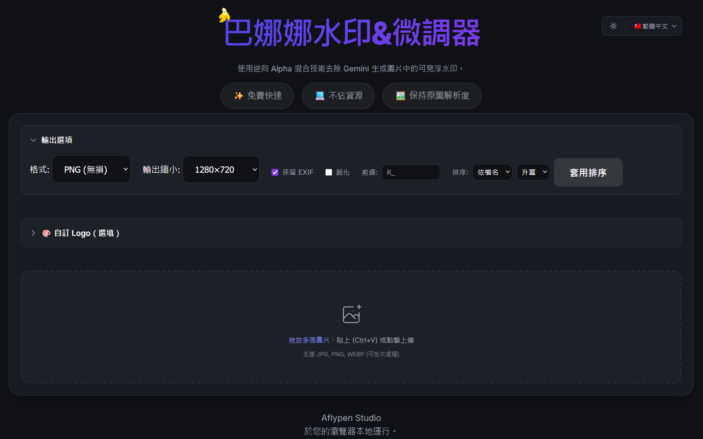
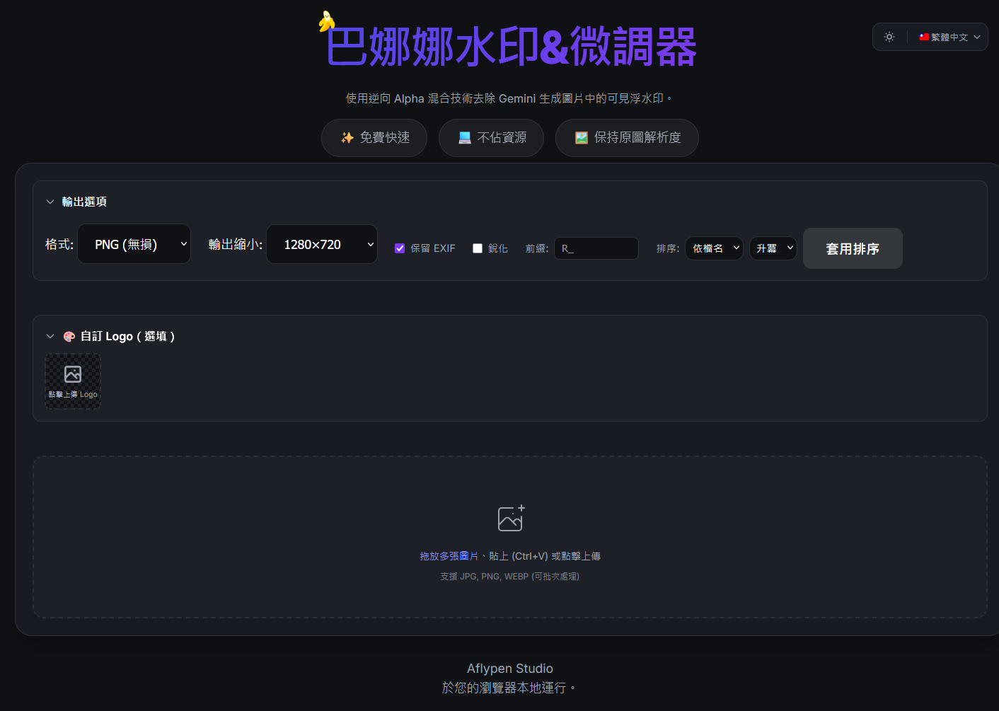

# Banana Watermark Remover & Adjuster

[](https://opensource.org/licenses/MIT)

[English](README.md) | [繁體中文](README_zh-TW.md) | [简体中文](README_zh-CN.md) | [日本語](README_ja.md) | [한국어](README_ko.md)

A powerful web tool designed to remove localized watermarks from images generated by Google Gemini. This tool runs entirely in your browser, ensuring your privacy by not uploading images to any server.

## 🎯 Key Difference from Original
This project is a **modified version** focused on watermark removal with additional logo customization features.

## 🖼️ Demo

<div align="center">
  
  
  
</div>


## ✨ Key Features

- **🚫 Automatic Watermark Removal**: Uses a Reverse Alpha Blending algorithm with multi-dimensional auto strength detection to precisely restore pixels covered by the watermark.
  - Search range: 0.05 ~ 2.0 (optimized from 0.1 ~ 1.2)
  - Step precision: 0.01 (doubled from 0.02)
  - Multi-dimensional evaluation: brightness uniformity, edge blending, peak detection
- **🎨 Smart Logo Overlay**: Upload your own logo to replace/cover the watermark area with intelligent positioning:
  - **Auto Positioning**: Logo automatically centers on the detected watermark position
  - **Consistent Size**: Logo size calculated based on image's shorter edge (same size for landscape & portrait)
  - **Adjustable Settings**: Opacity 0% ~ 100% (default: 20%), Size 10% ~ 300% (default: 200%)
- **🔧 Output Options**:
  - **Resize Presets**: 1280×720 / 1920×1080 (or disable)
  - **Keep EXIF**: Preserve original image metadata
  - **Sharpen**: Apply sharpening filter for better visual quality
  - **Filename Prefix**: Customize output filename prefix
  - **Sort**: Organize images by name or date, ascending or descending
- **📥 Flexible Download Options**:
  - **Single Image**: Click download for Logo version (R_/S_ prefix). Check the "N" box before downloading for a no-logo version (N_ prefix).
  - **Batch Download**: When logo is uploaded, ZIP includes both versions:
    - With Logo: `R_圖片_clean.png` (landscape) / `S_圖片_clean.png` (portrait)
    - No Logo: `N_圖片_clean.png`
- **🔒 Privacy First**: All processing is done locally in your browser; images never leave your device.
- **⚡ Instant Preview**: Upload and process instantly for quick results.
- **🖱️ Drag & Drop Support**: Simply drag images into the window to process them.
- **👀 Comparison Mode**: Long press (or click and hold) the processed image to see the original for comparison.
- **⚙️ Smart & Manual Modes**:
  - **Auto Detect**: Automatically determines watermark size based on image resolution.
  - **Manual Selection**: Force "Small" (48px) or "Large" (96px) mode for special cases.
- **💾 High Quality Download**: Download processed images in PNG (Lossless) or JPEG (Compressed) format.
- **📋 Clipboard Paste**: Support directly pasting (Ctrl+V) screenshots or images.
- **📦 Batch ZIP Download**: Automatically packages multiple images into a single ZIP file (`banana_watermark_remover.zip`).
- **🌐 Multi-language Support**: Interface available in English, Traditional Chinese, Simplified Chinese, Japanese, and Korean.

## 🛠️ How It Works

This project is implemented using pure JavaScript (Canvas API). It pre-loads the Alpha mask of the Gemini watermark and "reverses" the watermark's effect by calculating the original color values of each pixel, achieving a lossless or near-invisible removal.

## 🚀 How to Use

1. **Open the Page**: Open `index.html` directly in your browser.
2. **Upload Images**: Click the upload area or drag JPG/PNG/WEBP images into it.
3. **View Results**: The system will automatically process and display the results.
4. **Adjust Settings** (If needed): If the result is not perfect, try switching modes in the dropdown menu ("Force Small" or "Force Large").
5. **Download**:
   - **Single Image**: Click download button. Check "N" box to download no-logo version.
   - **Batch Download**: Click "Download All" button. ZIP contains R_/S_ (with logo) and N_ (without logo) versions.

## 📦 Installation & Running Locally

This is a static web project requiring no complex backend environment.

1. **Clone the Project**:
   ```bash
   git clone https://github.com/aflypenstudio/BananaWatermarkRemover.git
   ```
2. **Enter Directory**:
   ```bash
   cd BananaWatermarkRemover
   ```
3. **Run**:
   Open `index.html` in your browser.
   *Note: Due to browser CORS policies, loading local mask images directly via `file://` might fail. It is recommended to run a simple local server, for example using Python:*
   ```bash
   # Python 3
   python -m http.server 8000
   ```

   Then visit `http://localhost:8000` in your browser.

## 🙏 Acknowledgements

Special thanks to [GeminiWatermarkTool](https://github.com/allenk/GeminiWatermarkTool) and the original [GeminiWatermarkRemove](https://github.com/kevintsai1202/GeminiWatermarkRemove) project for providing valuable information and inspiration for this project.

## 📄 License

This project is licensed under the MIT License. See the [LICENSE](LICENSE) file for details.

